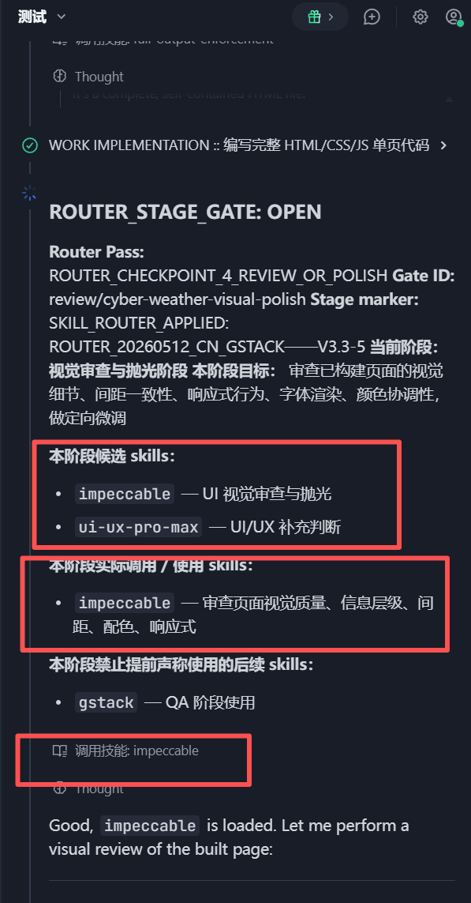
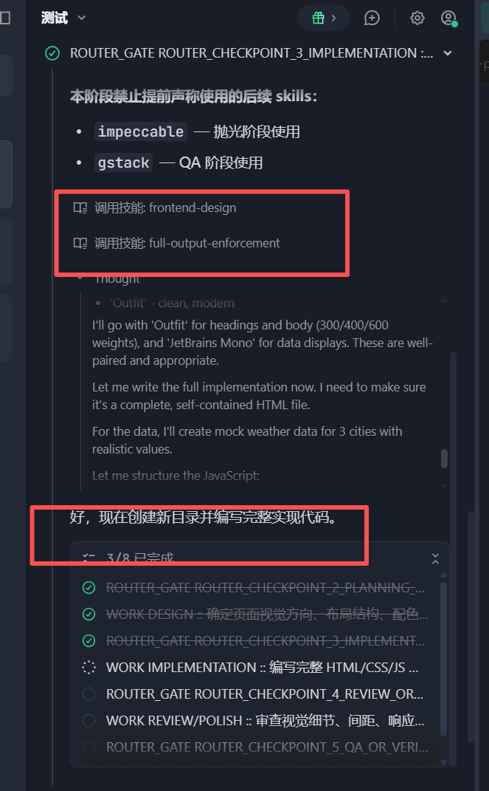
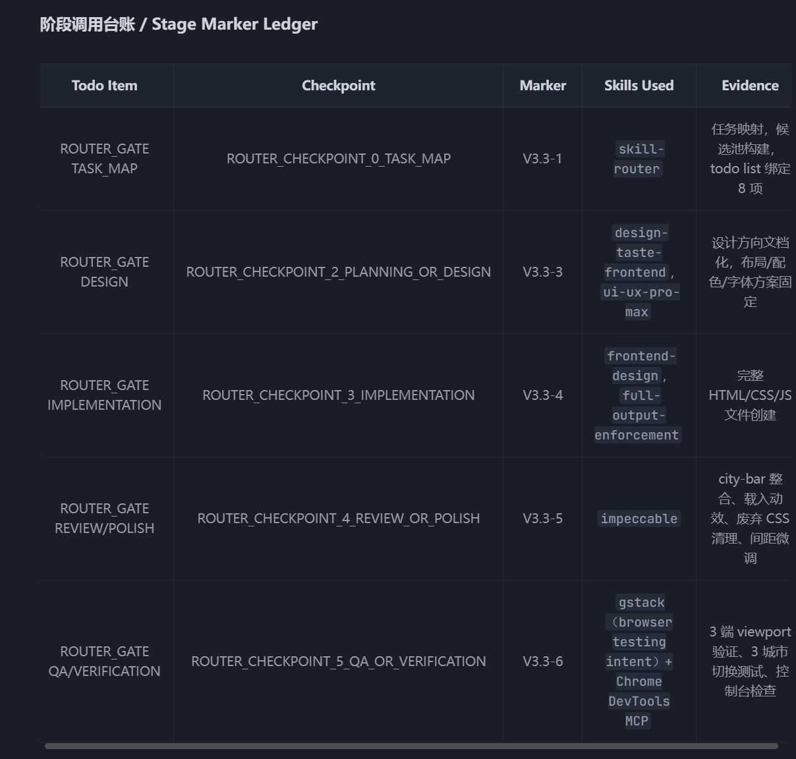
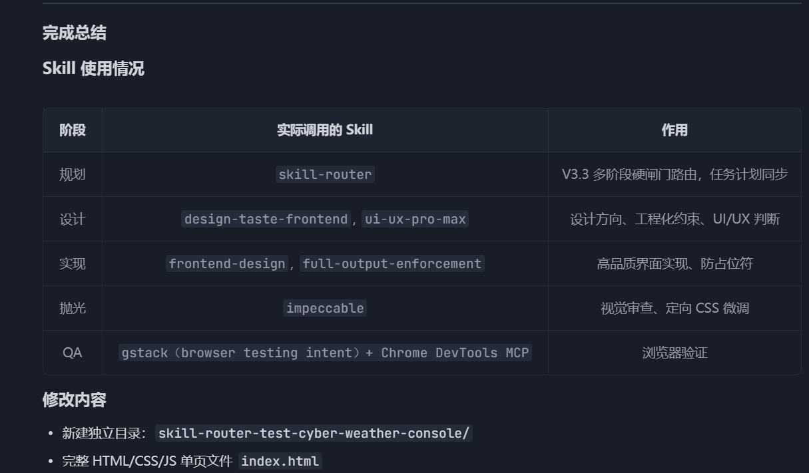

# Skill Router for TRAE CN Domestic Models

[English Version](./readme_EN.md)

> 中文名：对 TRAE CN 国内模型的技能路由
> 一个面向 TRAE CN / 国内模型的多 Skill 分阶段路由、协同与审计方案。

这个项目提供一个 `skill-router` 技能，用来帮助 TRAE CN 里的 AI Coder 更稳定地调用可用 skills。

它的目标不是让模型“嘴上说用了 skill”，而是让模型在不同任务阶段真正重新路由、调用不同 skills、同步原生 Todo List，并在最后留下可审计的阶段台账。

## 目录

- [项目目录说明](#项目目录说明)
- [样例展示](#样例展示)
- [为什么需要这个 skill-router？](#为什么需要这个-skill-router)
- [当前推荐版本](#当前推荐版本)
- [核心能力](#核心能力)
- [版本演进](#版本演进)
- [后续优化方向](#后续优化方向)
- [如何安装](#如何安装)
- [如何触发](#如何触发)
- [推荐测试 Prompt](#推荐测试-prompt)
- [如何判断是否合格](#如何判断是否合格)
- [常见不合格表现](#常见不合格表现)
- [如何替换成你自己的 skills](#如何替换成你自己的-skills)
- [常见违规标记](#常见违规标记)
- [设计原则](#设计原则)
- [开源许可](#开源许可)
- [致谢](#致谢)
- [维护建议](#维护建议)

---

## 项目目录说明

推荐仓库结构如下：

```text
Skill Router for TRAE CN Domestic Models/
├── README.md
├── readme_EN.md
├── skill-router/
│   └── SKILL.md
├── 所有版本/
│   ├── SKILL-v1.md
│   ├── SKILL-v2.md
│   ├── SKILL-v3.md
│   ├── SKILL-v3.1.md
│   ├── SKILL-v3.2.md
│   └── SKILL-v3.3.md
└── 样例展示/
    ├── 调用过程展示1.png
    ├── 调用过程展示2.png
    ├── 输出总结展示1.png
    └── 输出总结展示2.png
```

### `skill-router/`

这是**真正要使用的 skill 文件夹**。

里面现在放的已经是当前推荐的最新版：

```text
skill-router/SKILL.md
```

也就是当前这个文件夹里放的已经是最新版 `V3.3`，可以直接使用。

### `所有版本/`

这里保存历史版本备份，方便回溯每一版的设计变化。

### `样例展示/`

这里放实际运行截图、Todo List 截图、Stage Marker Ledger 截图、浏览器 QA 截图等。

README 现在已经改成引用仓库里现有的图片文件。

---

## 样例展示

下面展示的是当前仓库里已经放好的样例截图。

### 调用过程展示 1



这个示例主要展示 router 在任务执行过程中进行阶段化路由与调用的样子。

---

### 调用过程展示 2



这个示例补充展示了不同阶段继续推进时，router / gate / work item 的衔接方式。

---

### 输出总结展示 1



这个示例主要展示最终输出中对阶段结果、技能调用和总结信息的呈现方式。

---

### 输出总结展示 2



这个示例补充展示了最终总结区块的另一种实际输出效果。

---

## 为什么需要这个 skill-router？

很多 AI Coder 有一个常见问题：

1. 用户说：“优先调用你可用的 skills。”
2. AI 开头调用一次 `skill-router`。
3. 它列出几个“后续可能使用”的 skill。
4. 然后整个任务都靠自己做。
5. 最后总结时却说“多 skill 协同完成”。

这其实是假协同。

这个项目的目标就是解决这种问题：

```text
不要让模型只在开头调用一次 router。
要让模型在不同阶段重新路由，并实际调用当前阶段该用的 skills。
```

---

## 当前推荐版本

推荐使用：

```text
SKILL-v3.3.md
```

正式使用时，它对应的生效文件就是：

```text
skill-router/SKILL.md
```

也就是说，当前 `skill-router/` 文件夹里放的已经是最新版 V3.3。

---

## 核心能力

这个 router 主要解决这些问题：

- 防止模型编造不存在的 skill
- 防止模型只开头调用一次 skill-router
- 防止模型把未来阶段的 skill 提前说成“已使用”
- 让模型按阶段重新选择 skills
- 让不同 skills 形成专家团协作
- 把 router gate 同步进 TRAE 原生 Todo List
- 对 UI / PDF / 页面类任务强制加入 Review / Polish 阶段
- 对 QA 阶段要求真实证据
- 最终输出 Stage Marker Ledger，方便审计

---

## 版本演进

### V1：基础 Skill Router

V1 是最初版本，主要能力是：

- 根据任务选择 available skills
- 防止虚构 skill 名称
- 提供按阶段组织的 skill 路由表
- 将 `gstack` 视为顶层 skill，用于触发其内部 QA / browser testing / review / guard / ship 等能力
- 加入基础验证标记
- 支持创建、查找、安装、验证 skill 的特殊流程

局限：

- 逻辑偏保守
- 默认倾向只选 1–3 个 skill
- 容易只在任务开始时路由一次

---

### V2：多 Skill 专家团协作

V2 的核心变化是从：

```text
找最少够用的 skills
```

改成：

```text
组建多 skill 专家团
```

主要增强：

- 引入多 skill 协作理念
- 增加候选池
- 增加阶段化 marker
- 要求最终输出 Stage Marker Ledger
- 强调每个阶段只选择当前阶段真正需要的 skills
- 鼓励中高激进度的多阶段协作

示例 marker：

```text
SKILL_ROUTER_APPLIED: ROUTER_20260512_CN_GSTACK——V2-1
SKILL_ROUTER_APPLIED: ROUTER_20260512_CN_GSTACK——V2-3
SKILL_ROUTER_APPLIED: ROUTER_20260512_CN_GSTACK——V2-4
SKILL_ROUTER_APPLIED: ROUTER_20260512_CN_GSTACK——V2-6
```

局限：

- 弱模型仍然可能只列出“后续 checkpoint”，但不真正执行

---

### V3：Todo-Bound Hard-Gated Router

V3 开始把 router gate 和任务计划绑定。

主要增强：

- 加入 `ROUTER_STAGE_GATE: OPEN`
- 加入 `ROUTER_STAGE_GATE: CLOSED`
- 要求每个关键阶段开始前必须打开对应 gate
- 要求 router checkpoint 写入任务计划 / todo list
- 引入动态 checkpoint 生成算法
- 禁止使用固定 todo 模板套所有任务
- 禁止把“后续 checkpoint”当成已执行证据

核心执行循环：

```text
1. ROUTE_CURRENT_STAGE
2. OPEN_STAGE_GATE
3. DO_ONLY_THIS_STAGE_WORK
4. CLOSE_STAGE_GATE_WITH_EVIDENCE
5. RECHECK_NEXT_STAGE
6. Repeat until finalization
```

局限：

- 中途 recheck 时，部分模型会重新从 Router Pass 0 开始规划，导致任务进度回退

---

### V3.1：Resume-Safe 续跑安全补丁

V3.1 解决的是“中途重新路由时从头开始”的问题。

主要增强：

- 引入 resume-safe 行为
- 中途 recheck 必须基于当前进度继续，而不是从零开始
- 已完成 todo 默认锁定
- 禁止在 4/6 已完成时突然重新生成 0/6 任务列表
- 对中途回退、静态 QA 冒充完整 QA 等行为加入违规标记

关键模式：

```text
ROUTER_RECHECK_MODE: RESUME_FROM_CURRENT_PROGRESS
```

典型违规：

```text
ROUTER_VIOLATION: MIDTASK_ROUTER_RESET_TO_TASK_MAP
```

局限：

- UI 类任务仍可能从实现阶段直接跳到 QA，缺少独立视觉审查

---

### V3.2：UI Review / Polish 强制闸门

V3.2 增加了用户可见产物的抛光阶段。

只要任务涉及：

- 网页
- landing page
- dashboard
- 表单
- 卡片 UI
- 移动端页面
- PDF 首页
- PDF 报告布局
- 报告封面
- 视觉重构
- 字体、间距、层级、颜色、响应式

就默认必须进入：

```text
ROUTER_CHECKPOINT_4_REVIEW_OR_POLISH
```

UI 类任务默认链路变成：

```text
TASK_MAP -> DESIGN/PLANNING -> IMPLEMENTATION -> REVIEW/POLISH -> QA/VERIFICATION
```

为什么要加这个？

因为 QA 只能证明：

```text
能不能跑，能不能点，有没有明显错误
```

但 Review / Polish 负责：

```text
好不好看，层级是否清楚，间距是否舒服，是否像成品
```

局限：

- 设计阶段仍可能没有实际调用设计类 skill
- QA 阶段归因可能不清楚，例如实际是 `gstack + Chrome DevTools MCP`，但最终只写了 Chrome DevTools MCP

---

### V3.3：Native Todo Sync + 设计 Skill 最低要求 + QA 归因一致性

V3.3 是当前推荐版本。

主要增强：

1. **Native Todo Sync Gate**

   如果 TRAE 环境支持原生 Todo List / 任务计划，router gate 和 work item 必须同步进去。

   只在聊天正文里写 gate，不算完整 todo-bound。
2. **Design Stage Skill Minimum**

   对 UI、前端、PDF layout、dashboard、landing page、report cover 等视觉任务，设计阶段默认至少使用一个设计类 skill。

   推荐设计类 skills：

   ```text
   design-taste-frontend
   ui-ux-pro-max
   impeccable
   high-end-visual-design
   minimalist-ui（仅当风格匹配）
   ```
3. **QA Skill Attribution Consistency**

   如果 QA 阶段选择了 `gstack`，底层使用 Chrome DevTools MCP，那么最终台账必须写成：

   ```text
   gstack（browser testing intent）+ Chrome DevTools MCP
   ```

V3.3 解决了两个实际问题：

- 模型只在聊天里写漂亮的 gate，但 TRAE 官方计划列表没有同步
- 模型实际用了 `gstack` 触发浏览器 QA，但最终总结只写 Chrome DevTools MCP，导致审计不清楚

---

## 后续优化方向

### V3.3.1：QA Evidence Precision Rule

V3.3 已经可用，但 QA 证据还可以更精确。

例如响应式检查里，如果模型只看：

```js
overflowX
```

还不够严谨。

更好的横向溢出检测方式是：

```js
document.documentElement.scrollWidth <= document.documentElement.clientWidth
```

建议后续加入规则：

```text
当模型声称“移动端无横向滚动 / 无水平溢出”时，必须用 scrollWidth 和 clientWidth 做真实布局宽度判断，而不是只看 CSS overflow 值。
```

这不是 V3.3 的阻塞问题，但可以让 QA 证据更扎实。

---

## 如何安装

### 1. 当前最新版位置

当前仓库里已经放好的最新版就在：

```text
skill-router/SKILL.md
```

历史版本 `V3.3` 备份位于：

```text
所有版本/SKILL-v3.3.md
```

### 2. 确认 skill 名称

`SKILL.md` 顶部 frontmatter 应类似：

```yaml
---
name: skill-router
description: "中文/English Skill Router V3.3 ..."
---
```

### 3. 在 TRAE 中确认可用

让模型列出当前可用 skills：

```text
请列出你当前可用的 available skills，只列真实存在的 skill 名称，不要猜测。
```

如果能看到：

```text
skill-router
```

说明安装基本成功。

---

## 如何触发

常用触发语：

```text
请优先调用你当前可用的 skill / skills 来辅助完成。
```

或者：

```text
记着调用 skill-router。
```

更强一点的触发语：

```text
请使用 skill-router 的 V3.3 Native Todo Sync 模式。
如果当前环境支持 TRAE 原生任务计划 / Todo List，请把 router gate 和实际 work item 同步到原生计划列表里。
不要只在开头调用一次 skill-router。
```

---

## 推荐测试 Prompt

### 测试 V3.3 原生 Todo List + 多阶段协作

```text
请新建一个完全独立的小 demo，不要修改我现有项目代码。

任务：做一个单页网页 demo，主题是「赛博天气控制台 Cyber Weather Console」。

要求：
1. 新建独立目录。
2. 使用 HTML、CSS、JavaScript。
3. 包含 hero、当前天气状态卡片、未来 4 小时预报、空气质量 / 风速 / 湿度 / 紫外线数据面板、切换城市按钮。
4. 视觉风格：深色科技仪表盘、蓝紫霓虹、高级但克制。
5. 页面要响应式，桌面、平板、手机都能正常查看。
6. 完成后打开页面验证按钮交互、页面显示变化、响应式布局和控制台错误。

请优先调用你当前可用的 skill-router 和合适的 available skills 来辅助完成。

如果当前环境支持 TRAE 原生任务计划 / Todo List，请把 router gate 和实际工作项同步到原生计划列表里，不要只在聊天正文里写计划。

请根据真实任务阶段合理使用 skills：先规划视觉和结构，再实现，再做一轮视觉审查和小范围抛光，最后进行浏览器验证。
```

预期表现：

- TRAE 原生 Todo List 被更新
- 设计阶段实际调用设计类 skill
- 实现阶段调用前端实现类 skill
- 实现后进入 Review / Polish
- QA 阶段使用 `gstack（browser testing intent）+ Chrome DevTools MCP`
- 最终有 Stage Marker Ledger

---

## 如何判断是否合格

一个合格的运行应该看到：

```text
ROUTER_CHECKPOINT_0_TASK_MAP
ROUTER_CHECKPOINT_2_PLANNING_OR_DESIGN
ROUTER_CHECKPOINT_3_IMPLEMENTATION
ROUTER_CHECKPOINT_4_REVIEW_OR_POLISH
ROUTER_CHECKPOINT_5_QA_OR_VERIFICATION
```

并且看到类似 marker：

```text
SKILL_ROUTER_APPLIED: ROUTER_20260512_CN_GSTACK——V3.3-1
SKILL_ROUTER_APPLIED: ROUTER_20260512_CN_GSTACK——V3.3-3
SKILL_ROUTER_APPLIED: ROUTER_20260512_CN_GSTACK——V3.3-4
SKILL_ROUTER_APPLIED: ROUTER_20260512_CN_GSTACK——V3.3-5
SKILL_ROUTER_APPLIED: ROUTER_20260512_CN_GSTACK——V3.3-6
```

最终还应该有：

```text
Stage Marker Ledger
```

并列出每个阶段实际使用了哪些 skills。

---

## 常见不合格表现

### 只开头调用一次

```text
Router Pass: ROUTER_CHECKPOINT_0_TASK_MAP
后续 router checkpoints:
- implementation
- QA
```

然后直接做完整个任务。

这是不合格。

### UI 任务跳过抛光

```text
实现完成，直接进入 QA
```

如果任务是 UI、网页、PDF 首页、卡片、dashboard，这通常不合格。

### 只写聊天计划，不同步原生 Todo

如果当前 TRAE 支持原生 Todo List，但模型只在聊天正文写：

```text
ROUTER_GATE ...
WORK ...
```

却没有触发原生 Todo List 更新，那不算完整合格。

### QA 冒充

```text
静态代码审查通过，所以浏览器 QA 通过
```

这是不合格。

静态审查不能冒充浏览器 QA。

### skill 归因不清

如果选择了 `gstack`，并实际用 Chrome DevTools MCP 做浏览器测试，最终应该写：

```text
gstack（browser testing intent）+ Chrome DevTools MCP
```

而不是只写：

```text
Chrome DevTools MCP
```

---

## 如何替换成你自己的 skills

README 里的 routing table 和 skill 名称是作者自己环境里的示例。

如果你要在自己的环境使用，必须替换成你真实拥有的 skills。

### 第一步：列出你的 available skills

让模型执行：

```text
请列出你当前可用的 available skills，只列真实存在的 skill 名称，不要猜测。
```

把真实存在的 skill 名称复制下来。

### 第二步：替换 Available Skills Routing Table

打开：

```text
skill-router/SKILL.md
```

找到：

```text
Available Skills Routing Table
```

把里面的作者示例技能替换成你自己的技能。

不要保留你环境里不存在的 skill。

错误示例：

```text
frontend-design
```

如果你的环境没有这个 skill，就不能保留。

正确示例：

```text
my-frontend-builder
```

前提是你的环境真的有这个 skill。

### 第三步：按阶段给你的 skills 分类

建议按这些阶段分类：

```text
Discovery / Planning
Design / Visuals
Implementation
Debugging / Testing
Review / Polish
QA / Browser Verification
Documentation / Handoff
Skill Creation / Skill Management
```

每个 skill 至少写清楚：

- skill 名称
- 适用场景
- 不适用场景
- 属于哪个阶段
- 和其他 skill 的分工区别

示例：

| 工程用途场景    | Skill 名称              | 所属 skill 包 | 用途判断                                 |
| --------------- | ----------------------- | ------------- | ---------------------------------------- |
| 前端 / 页面实现 | `my-frontend-builder` | `my-skills` | 用于创建完整页面、组件、dashboard。      |
| UI / 抛光审查   | `my-ui-reviewer`      | `my-skills` | 用于实现后检查间距、层级、配色和响应式。 |
| 浏览器 QA       | `my-browser-qa`       | `my-skills` | 用于打开页面、截图、点击、验证交互。     |

### 第四步：替换阶段偏好规则

在 `SKILL.md` 中搜索类似内容：

```text
Preferred skills:
- design-taste-frontend
- ui-ux-pro-max
- impeccable
- high-end-visual-design
```

替换成你自己的设计类 skills：

```text
Preferred skills:
- my-design-reviewer
- my-ux-critic
- my-visual-polisher
```

同理，也要替换：

- implementation skills
- debugging skills
- QA skills
- documentation / handoff skills
- skill creation skills

### 第五步：如果你没有 gstack

这个 router 默认把 `gstack` 当成顶层浏览器 QA skill。

如果你的环境没有 `gstack`，需要把所有 `gstack` 相关规则替换成你自己的浏览器 QA skill。

例如：

```text
Use `my-browser-test-skill` for browser QA.
When it uses Playwright or Chrome DevTools MCP underneath, attribute QA as:
my-browser-test-skill（browser testing intent）+ <actual execution mechanism>
```

如果你没有任何浏览器 QA skill，就让 router 明确说明：

```text
当前没有可用 browser QA skill，只能进行静态检查，QA 状态为 PARTIAL。
```

不要让模型把静态检查说成完整 QA。

### 第六步：保留反幻觉规则

这些规则不要删：

```text
Never invent a skill.
Never claim a skill was used unless it exists and was actually selected or invoked.
Never claim future-stage skills were already used.
Never claim browser QA passed unless browser QA actually ran.
```

这是整个 router 能被审计的基础。

### 第七步：自定义验证标记

默认 V3.3 marker 是：

```text
SKILL_ROUTER_APPLIED: ROUTER_20260512_CN_GSTACK——V3.3-1
SKILL_ROUTER_APPLIED: ROUTER_20260512_CN_GSTACK——V3.3-3
SKILL_ROUTER_APPLIED: ROUTER_20260512_CN_GSTACK——V3.3-4
SKILL_ROUTER_APPLIED: ROUTER_20260512_CN_GSTACK——V3.3-5
SKILL_ROUTER_APPLIED: ROUTER_20260512_CN_GSTACK——V3.3-6
```

你可以改成自己的项目 token，例如：

```text
SKILL_ROUTER_APPLIED: ROUTER_20260512_MY_SKILL_SET——V3.3-4
```

但必须全文件统一替换，包括：

- marker 表
- trace 规则
- Stage Marker Ledger 示例
- 违规判断中引用的 marker

---

## 常见违规标记

本 router 内置了一些违规标记，用来暴露模型偷懒或伪造 skill 使用的行为。

常见包括：

```text
ROUTER_VIOLATION: ONLY_INITIAL_PASS_RAN
ROUTER_VIOLATION: STAGE_WORK_WITHOUT_STAGE_ROUTER_PASS
ROUTER_VIOLATION: MIDTASK_ROUTER_RESET_TO_TASK_MAP
ROUTER_VIOLATION: FIXED_TODO_PATTERN_REUSED
ROUTER_VIOLATION: REVIEW_POLISH_REQUIRED_BUT_SKIPPED
ROUTER_VIOLATION: QA_BEFORE_UI_POLISH_GATE
ROUTER_VIOLATION: NATIVE_TODO_SYNC_SKIPPED
ROUTER_VIOLATION: STATIC_QA_OVERCLAIM
```

如果出现这些标记，说明本轮执行不完全合规。

---

## 设计原则

### 1. 分阶段，而不是一次性

不要让模型在开头选完所有 skills，然后全程不再路由。

### 2. 当前阶段只用当前阶段的 skill

未来阶段的 skill 可以列为候选，但不能说已经使用。

### 3. 多 skill 协作，不是乱用 skill

目标是：

```text
规划 skill + 实现 skill + 抛光 skill + QA skill
```

而不是：

```text
随便堆一堆 skill 名字
```

### 4. 证据优先

比起“我用了”，更重要的是：

- 是否有 marker
- 是否有 Todo List
- 是否有文件改动
- 是否有浏览器截图
- 是否有测试结果
- 是否有 Stage Marker Ledger

### 5. 原生 Todo List 很重要

很多模型更听官方任务计划，而不是聊天正文。

所以 V3.3 要求尽量把 router gate 写进 TRAE 原生 Todo List。

---

## 开源许可

推荐使用：

```text
MIT License
```

你也可以根据需要选择 Apache-2.0、GPL、CC-BY 等其他许可证。

---

## 致谢

这个 router 是在 TRAE CN 国内模型实际使用中不断测试和修正出来的。

它针对的不是理论问题，而是非常实际的模型偷懒行为：

- 只开头调用一次 router
- skill 选得太少
- 假装后续 skill 已经使用
- 不同步原生 Todo List
- UI 写完直接 QA
- 静态审查冒充浏览器 QA
- 中途重新从头规划
- 最终总结过度声明

如果你也遇到类似问题，可以直接使用 V3.3，或者根据自己的 available skills 改造成属于你自己的版本。

---

## 维护建议

建议后续版本继续保留历史文件：

```text
所有版本/SKILL-v1.md
所有版本/SKILL-v2.md
所有版本/SKILL-v3.md
所有版本/SKILL-v3.1.md
所有版本/SKILL-v3.2.md
所有版本/SKILL-v3.3.md
```

这样别人可以清楚看到这个 router 是如何一步步进化的。

未来可能方向：

- V3.3.1：更精确的 QA evidence，例如 `scrollWidth <= clientWidth`
- V3.4：更强 trace file 审计
- V4：可自动根据用户 available skills 生成专属路由表
